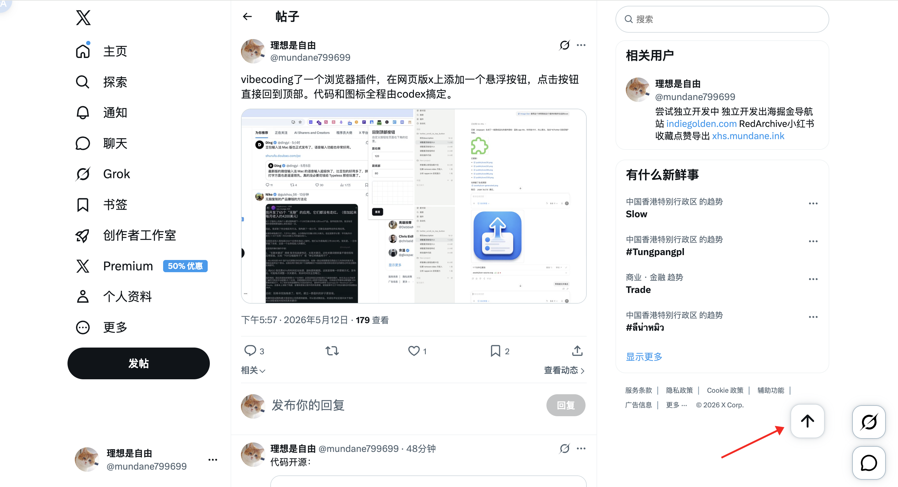

# Twitter Scroll to Top Button

A lightweight browser extension that adds a floating scroll-to-top button to Twitter/X.

It is built for the tiny moment when you are deep in the timeline and just want one clean click back to the top.



## Features

- Adds a floating scroll-to-top button on `twitter.com` and `x.com`
- Smoothly scrolls the current page back to the top
- Lets you customize the button position from the extension popup
- Matches the native Twitter/X floating action style
- Stores preferences locally in the browser
- Does not require account login or remote code

## Permissions

This extension keeps its permissions narrow and uses them only for the scroll-to-top experience.

| Permission | Why it is needed |
| --- | --- |
| `activeTab` | Sends updated button position settings from the popup to the currently active Twitter/X tab. |
| `storage` | Saves the user's preferred button position and popup language locally. |
| `twitter.com`, `x.com` | Runs the content script only on Twitter/X pages so the button can be added there. |

## Privacy

Twitter Scroll to Top Button does not collect, sell, transmit, or analyze personal data.

Settings are stored locally in your browser. The extension does not use remote code, external analytics, or third-party tracking services.

## Development

Install dependencies:

```sh
pnpm install
```

Start the WXT development server:

```sh
pnpm dev
```

Run tests:

```sh
pnpm test
```

Run TypeScript checks:

```sh
pnpm compile
```

Build the extension:

```sh
pnpm build
```

Create a Chrome Web Store zip package:

```sh
pnpm zip
```

## Tech Stack

- [WXT](https://wxt.dev/)
- React
- TypeScript

## License

Not specified.
